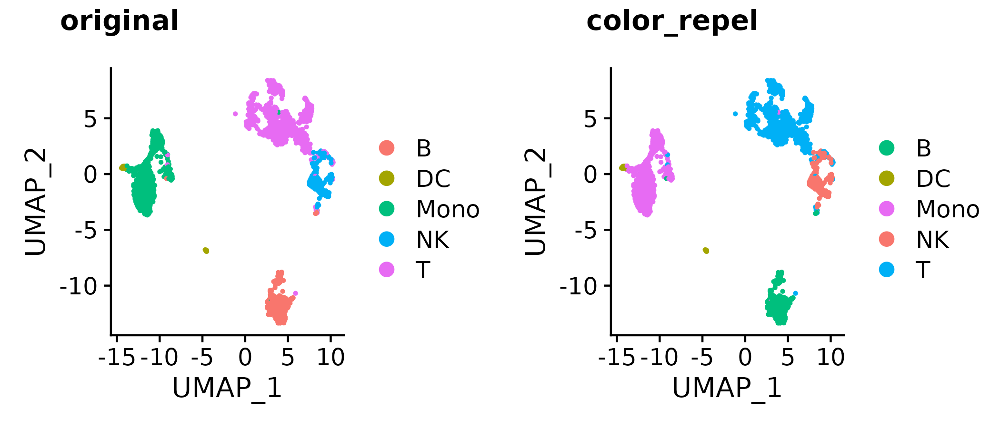
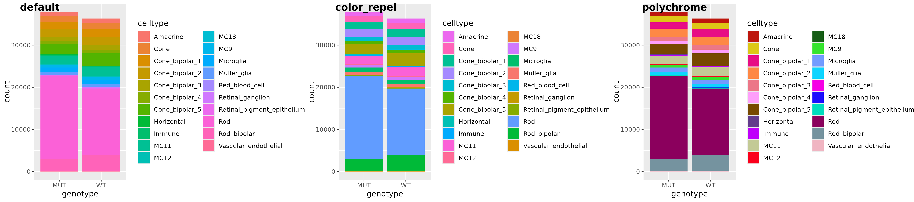
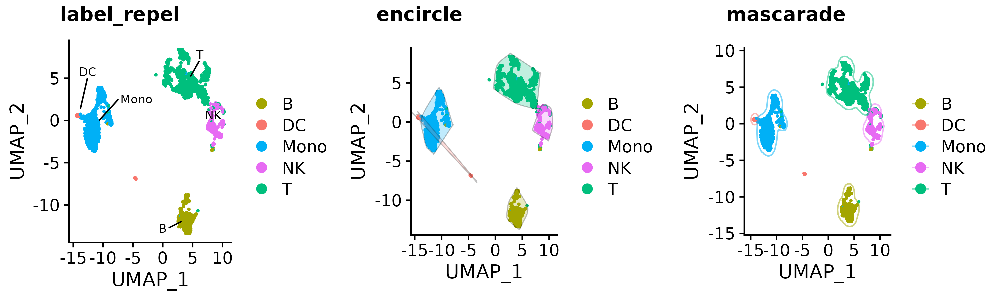
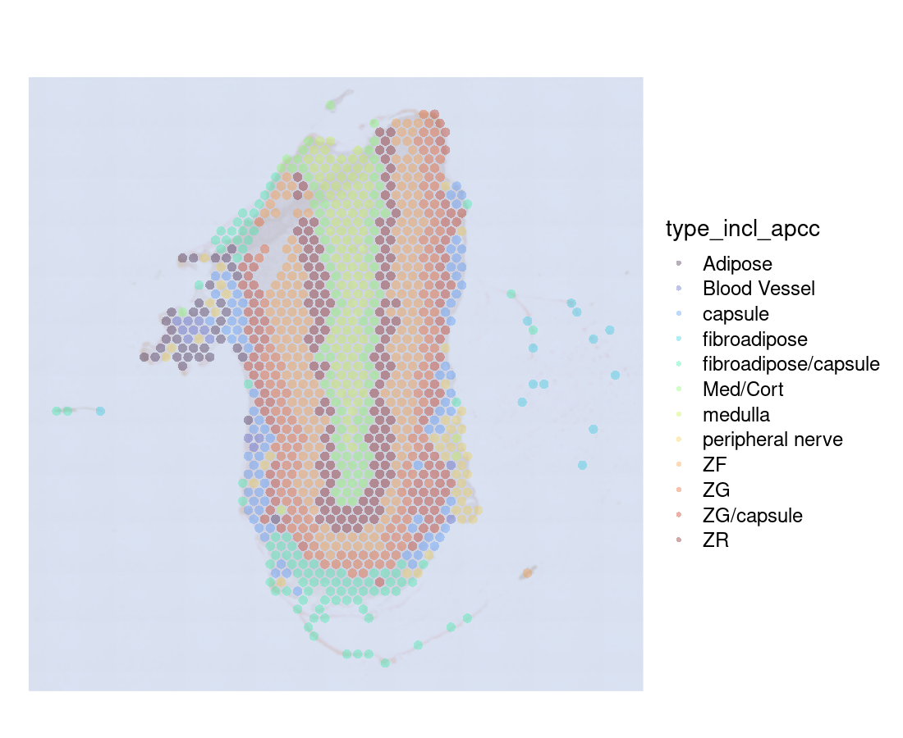
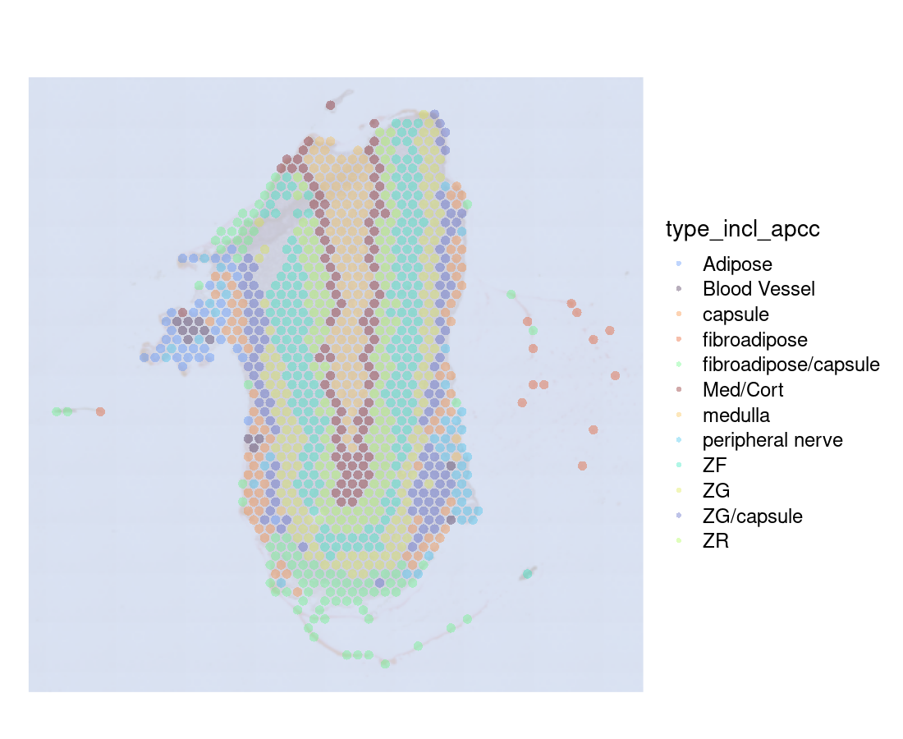

# color_repel

<!-- badges: start -->
  [](https://CRAN.R-project.org/package=colorrepel)
  [](https://CRAN.R-project.org/package=colorrepel)
<!-- badges: end -->

### Repel visually similar colors away for colorblind users
  
For work (single cell RNA-seq) I make and look at countless plots. Though most packages attempt to be colorblind-aware/friendly, I often find results uninterpretable when over a handful of colors are used. Some helpful strategies include: scatterHatch, adding different hatch patterns to clusters on top of colors; ggtrace; plotly interactivity; etc. But perhaps a simpler solution can be used -- avoid using visually similar colors next to each other (ie. on a UMAP, neighboring clusters should never be light yellow and slightly darker yellow). In 1D plots (barplot, violin plots, etc), we'd simply pass a vector of dissimilar colors. Not so easy to do when 2D and many colors are involved. Hence this simple package.

### How this works

0. extract colors from plot object or just use a desired vector of colors
1. generate distance matrix of categories (clusters on 2D plot, group on other types of plots)
2. generate distance matrix of colors, after conversion to CIELab space (and possibly various colorblindness conversion functions)
3. find optimal assignments of color to above groups/clusters to avoid plotting visually similar colors near each other
4. recolor (with option to add repelled text label for each group as well)
5. add encircle geom if desired

### Installation

```
# now on CRAN
install.packages("colorrepel")

# or latest devel version from github
devtools::install_github("https://github.com/raysinensis/color_repel")

library(colorrepel)
?gg_color_repel # overall wrapper function
```

### Examples

```
a <- Seurat::DimPlot(so, group.by = "type", pt.size = 0.5)
b <- a + scale_color_manual(values = color_repel(a, sim = colorspace::tritan))
cowplot::plot_grid(a, b, 
                   labels = c("original", "color_repel"))
```



```
a <- readRDS("bar_gg.rds")
# `color_repel` reorders colors
b <- a + scale_fill_manual(values = color_repel(a, col = "fill"))
# or use wrapper, with option to recolor with `polychrome`- better suited for 20+ colors
c <- gg_color_repel(a, sim = colorspace::deutan, polychrome_recolor = TRUE)
cowplot::plot_grid(a, b, c, labels = c("default", "color_repel", "polychrome"), nrow = 1)
```



```
a <- Seurat::DimPlot(so, group.by = "type", pt.size = 0.5)
b <- gg_color_repel(a, repel_label = T)
c <- gg_color_repel(a, encircle = T)
d <- gg_color_repel(a, mascarade = T)
cowplot::plot_grid(b, c, d, 
  labels = c("label_repel", "encircle", "mascarade"),
  nrow = 1
)
```



---------------

Also see it in action here: https://raysinensis.shinyapps.io/spatialshiny_adr/

  -->  

For layering non-interactive annotations and interactive points, see example: https://raysinensis.github.io/color_repel/

### Citation

In situ reconstruction of distinct normal and pathological cell populations within the human adrenal gland.	*Journal of the Endocrine Society*, 2023. Fu R, Walters K, Kaufman M, Kocs K, Baldwin A, Kiseljak-Vassiliades K, Fishbein L, Mukherjee N. https://doi.org/10.1210/jendso/bvad131
