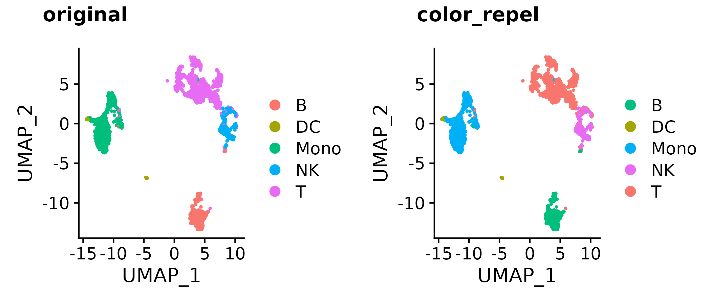
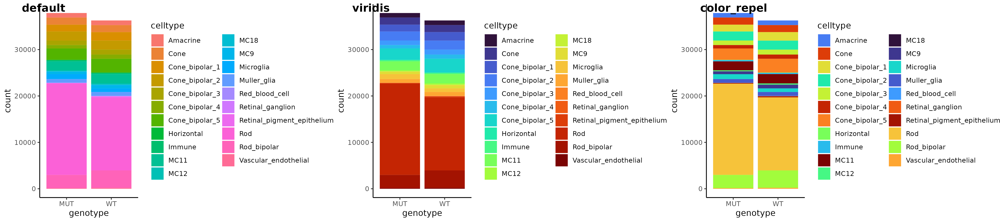

# color_repel

### Repel visually similar colors away for colorblind users

For work (single cell RNA-seq) I make and look at countless plots. Though most packages attempt to be colorblind-aware/friendly, I often find results uninterpretable when over a handful of colors are used. Some helpful strategies include: scatterHatch, adding different hatch patterns to clusters on top of colors; ggtrace; plotly interactivity; etc. But perhaps a simpler solution can be used -- avoid using visually similar colors next to each other (ie. on a UMAP, neighboring clusters should never be light yellow and slightly darker yellow).

### How this works

0. extract colors from plot object or just use a desired vector of colors
1. generate distance matrix of categories (clusters on 2D plot, group on other types of plots)
2. generate distance matrix of colors, after conversion to CIELab space (and possibly various colorblindness conversion functions)
3. find optimal assignments of color to above groups/clusters to avoid plotting visually similar colors near each other
4. recolor

### Installation

```
devtools::install_github("https://github.com/raysinensis/color_repel")
library(colorrepel)
```

### Examples

```
a <- Seurat::DimPlot(so, group.by = "type", pt.size = 0.5)
b <- a + scale_color_manual(values = color_repel(a, sim = colorspace::tritan))
cowplot::plot_grid(a, b, 
                   labels = c("original", "color_repel"))
```



```
a <- readRDS("bar_gg.rds")
b <- a + scale_fill_viridis_d(option = "H")
c <- b + scale_fill_manual(values = color_repel(b, col = "fill"))
# or use wrapper
c <- gg_color_repel(b, col = "fill")
cowplot::plot_grid(a,b,c, labels = c("default", "viridis", "color_repel"), nrow = 1)
```



